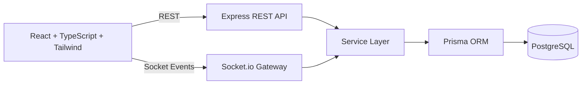

# Real-Time Collaboration Platform

Google Docs-style collaborative editor built with React, Node.js, Socket.io, Prisma, and PostgreSQL.


## Overview

This project provides a production-style collaborative document system with:
- JWT-based authentication
- Document CRUD with owner/collaborator access control
- Real-time multi-user editing and cursor updates
- Share permissions (`READ` / `WRITE`)
- Version history with restore support
- Dockerized full-stack setup for fast local and deploy-ready usage

## Core Features

| Area | Capability |
|---|---|
| Auth | Register, login, logout, current user endpoint |
| Access Control | Owner + collaborator model with role-based permissions |
| Documents | Create, edit, list, delete documents |
| Sharing | Invite collaborators with `READ` or `WRITE` access |
| Realtime | Live content sync, cursor presence, join notifications |
| Versioning | Auto version history + restore older versions |
| Security | Bcrypt password hashing, JWT middleware, Zod validation, rate limits, Helmet |
| Quality | Jest + Supertest + socket event tests |
| Ops | Docker Compose with backend, frontend, PostgreSQL |

## System Architecture



## Tech Stack

- Frontend: React, TypeScript, Vite, Tailwind CSS, Zustand, Socket.io-client
- Backend: Node.js, Express, Socket.io, Prisma, Zod, JWT
- Database: PostgreSQL
- Testing: Jest, Supertest, socket.io-client
- Tooling: ESLint, Prettier, Docker, Docker Compose, Nginx

## Project Structure

```text
.
|-- backend
|   |-- prisma
|   |   `-- schema.prisma
|   |-- src
|   |   |-- config
|   |   |-- controllers
|   |   |-- lib
|   |   |-- middlewares
|   |   |-- models
|   |   |-- routes
|   |   |-- services
|   |   |-- sockets
|   |   |-- types
|   |   `-- utils
|   |-- tests
|   `-- package.json
|-- frontend
|   |-- src
|   |   |-- components
|   |   |-- hooks
|   |   |-- pages
|   |   |-- services
|   |   |-- store
|   |   `-- types
|   `-- package.json
|-- docker-compose.yml
`-- README.md
```

## Quick Start (Docker)

```bash
docker compose up --build
```

After startup:
- Frontend: `http://localhost:8080`
- Backend: `http://localhost:4000`
- PostgreSQL: `localhost:5432`
- Health check: `http://localhost:4000/health`

## Local Development Setup

### 1. Install dependencies

```bash
cd backend && npm install
cd ../frontend && npm install
```

### 2. Configure environment files

```bash
cp backend/.env.example backend/.env
cp frontend/.env.example frontend/.env
```

PowerShell alternative:

```powershell
Copy-Item backend/.env.example backend/.env
Copy-Item frontend/.env.example frontend/.env
```

### 3. Prepare database

```bash
cd backend
npx prisma generate
npx prisma migrate dev --name init
```

### 4. Run apps

```bash
# Terminal 1
cd backend
npm run dev

# Terminal 2
cd frontend
npm run dev
```

Local URLs:
- Frontend: `http://localhost:5173`
- Backend: `http://localhost:4000`

## Environment Variables

### Backend (`backend/.env`)

| Variable | Required | Description |
|---|---|---|
| `NODE_ENV` | No | `development` or `production` |
| `PORT` | No | Backend port (default `4000`) |
| `DATABASE_URL` | Yes | PostgreSQL connection string |
| `JWT_SECRET` | Yes | JWT signing secret (use strong value in production) |
| `JWT_EXPIRES_IN` | No | Token expiry (example: `1d`) |
| `CORS_ORIGIN` | Yes | Allowed frontend origin |

### Frontend (`frontend/.env`)

| Variable | Required | Description |
|---|---|---|
| `VITE_API_BASE_URL` | Yes | Backend REST base URL |
| `VITE_SOCKET_URL` | Yes | Backend Socket.io URL |

## API Endpoints

### Auth
- `POST /api/auth/register`
- `POST /api/auth/login`
- `POST /api/auth/logout`
- `GET /api/auth/me`

### Documents
- `GET /api/documents`
- `POST /api/documents`
- `GET /api/documents/:id`
- `PUT /api/documents/:id`
- `DELETE /api/documents/:id`
- `POST /api/documents/:id/share`
- `GET /api/documents/:id/versions`
- `POST /api/documents/:id/versions/:versionId/restore`

## Realtime Socket Events

| Event | Direction | Purpose |
|---|---|---|
| `document:join` | Client -> Server | Join a document room |
| `document:update` | Client -> Server | Broadcast content updates |
| `cursor:update` | Client -> Server | Broadcast cursor metadata |
| `notification:collaborator-joined` | Server -> Clients | Notify room on collaborator join |

## Security and Reliability

- Password hashing via `bcrypt` (`12` rounds)
- JWT auth middleware for protected routes
- Input validation with Zod schemas
- Global + auth rate limiting
- Helmet security headers
- ORM-based DB access via Prisma
- Environment-based secret management

## Testing and Quality

Run backend tests:

```bash
cd backend
npm test
```

Build frontend:

```bash
cd frontend
npm run build
```

Lint:

```bash
cd backend && npm run lint
cd ../frontend && npm run lint
```

## Deployment Notes

### Render
1. Create PostgreSQL service.
2. Deploy backend (`backend/`) as Web Service.
3. Set backend environment variables.
4. Deploy frontend (`frontend/`) as Static Site.
5. Set `VITE_API_BASE_URL` and `VITE_SOCKET_URL` to backend URL.

### Railway
1. Provision PostgreSQL plugin.
2. Deploy backend service from `backend/`.
3. Run migrations using `prisma migrate deploy`.
4. Deploy frontend service from `frontend/`.
5. Configure frontend env vars to Railway backend URL.

### AWS (ECS + RDS + ALB)
1. Push backend/frontend images to ECR.
2. Create PostgreSQL on RDS.
3. Run backend on ECS Fargate with secret injection.
4. Serve frontend via ALB container or S3 + CloudFront.
5. Enable HTTPS and production CORS policy.

## Screenshots

Place final screenshots here and reference them in README:
- `docs/screenshots/dashboard.png`
- `docs/screenshots/editor.png`
- `docs/screenshots/version-history.png`

## Roadmap

- CRDT/OT-based conflict resolution
- Redis adapter for horizontal Socket.io scaling
- Refresh token rotation + revocation
- Rich text editor (TipTap/Lexical/Slate)
- Audit logs and activity timeline
- End-to-end tests with Playwright

## License

License not specified yet. Add a `LICENSE` file before public/commercial distribution.
