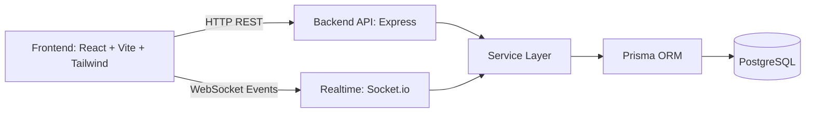

<div align="center">
  <h1>Real-Time Collaboration Platform</h1>
  <p><strong>A private, Google Docs-style editor for teams to write together in real time.</strong></p>
  <p>Built with React + Node.js + Socket.io + PostgreSQL</p>
</div>

<p align="center">
  
  
  
  
  
</p>

## What This Project Is (Simple Explanation)

If someone has never coded before, think of this as:

> A private company version of Google Docs where multiple people can open the same document, type together live, see each other updates instantly, and restore old versions if needed.

You can:
- create documents
- share them with specific users
- control access (`READ` or `WRITE`)
- collaborate in real time
- track and restore version history

## Product Highlights

| Capability | What it does |
|---|---|
| Secure Login | User signup/login with hashed passwords + JWT authentication |
| Document Management | Create, read, update, delete documents |
| Sharing & Permissions | Invite collaborators with `READ` or `WRITE` rights |
| Real-Time Collaboration | Live typing sync using Socket.io |
| Presence Signals | Collaborator join notifications + cursor updates |
| Version Control | Save versions and restore an older state |
| Security Layer | Zod validation, rate limits, Helmet, auth middleware |
| Production Setup | Dockerized backend, frontend, and PostgreSQL |

## End-to-End User Flow

1. User registers and logs in.
2. User creates a document.
3. Owner shares document with another user.
4. Both open the same document and edit live.
5. Every update can be stored and restored from version history.

## Architecture



## Tech Stack

- Frontend: React, TypeScript, Vite, Tailwind CSS, Zustand, Socket.io-client
- Backend: Node.js, Express, Socket.io, Prisma, Zod, JWT
- Database: PostgreSQL
- Testing: Jest, Supertest, socket.io-client
- DevOps: Docker, Docker Compose, Nginx

## Repository Structure

```text
.
|-- backend/
|   |-- prisma/
|   |-- src/
|   |-- tests/
|   `-- package.json
|-- frontend/
|   |-- src/
|   `-- package.json
|-- docker-compose.yml
|-- LICENSE
`-- README.md
```

## Quick Start (Docker)

```bash
docker compose up --build
```

Services:
- Frontend: `http://localhost:8080`
- Backend: `http://localhost:4000`
- PostgreSQL: `localhost:5432`
- Health: `http://localhost:4000/health`

## Local Development

### 1) Install dependencies

```bash
cd backend && npm install
cd ../frontend && npm install
```

### 2) Create environment files

```bash
cp backend/.env.example backend/.env
cp frontend/.env.example frontend/.env
```

PowerShell:

```powershell
Copy-Item backend/.env.example backend/.env
Copy-Item frontend/.env.example frontend/.env
```

### 3) Initialize database

```bash
cd backend
npx prisma generate
npx prisma migrate dev --name init
```

### 4) Run apps

```bash
# terminal 1
cd backend
npm run dev

# terminal 2
cd frontend
npm run dev
```

## Environment Variables

### Backend (`backend/.env`)

| Variable | Description |
|---|---|
| `NODE_ENV` | Environment (`development` / `production`) |
| `PORT` | Backend port |
| `DATABASE_URL` | PostgreSQL connection string |
| `JWT_SECRET` | JWT signing secret |
| `JWT_EXPIRES_IN` | Token expiration window |
| `CORS_ORIGIN` | Allowed frontend origin |

### Frontend (`frontend/.env`)

| Variable | Description |
|---|---|
| `VITE_API_BASE_URL` | Backend API base URL |
| `VITE_SOCKET_URL` | Backend socket server URL |

## API Reference

### Auth
- `POST /api/auth/register`
- `POST /api/auth/login`
- `POST /api/auth/logout`
- `GET /api/auth/me`

### Documents
- `GET /api/documents`
- `POST /api/documents`
- `GET /api/documents/:id`
- `PUT /api/documents/:id`
- `DELETE /api/documents/:id`
- `POST /api/documents/:id/share`
- `GET /api/documents/:id/versions`
- `POST /api/documents/:id/versions/:versionId/restore`

## Realtime Event Contract

| Event | Direction | Purpose |
|---|---|---|
| `document:join` | Client -> Server | Join document room |
| `document:update` | Client -> Server | Push content changes |
| `cursor:update` | Client -> Server | Push cursor metadata |
| `notification:collaborator-joined` | Server -> Clients | Broadcast collaborator join |

## Security and Quality

- `bcrypt` password hashing (12 rounds)
- JWT route protection
- Zod schema validation
- Rate limiting (global + auth routes)
- Helmet security headers
- Prisma ORM safe DB access
- Automated tests for auth, documents, and socket events

Run tests:

```bash
cd backend
npm test
```

Run production build:

```bash
cd frontend
npm run build
```

## Deployment Options

- Render
- Railway
- AWS (ECS + RDS + ALB)

Use production secrets and migrate with `prisma migrate deploy`.

## License

This repository is under a **Proprietary License (All Rights Reserved)**.

You are **not allowed** to copy, modify, distribute, sublicense, sell, or commercially use this code without explicit written permission from the author.

See [LICENSE](./LICENSE) for full terms.
