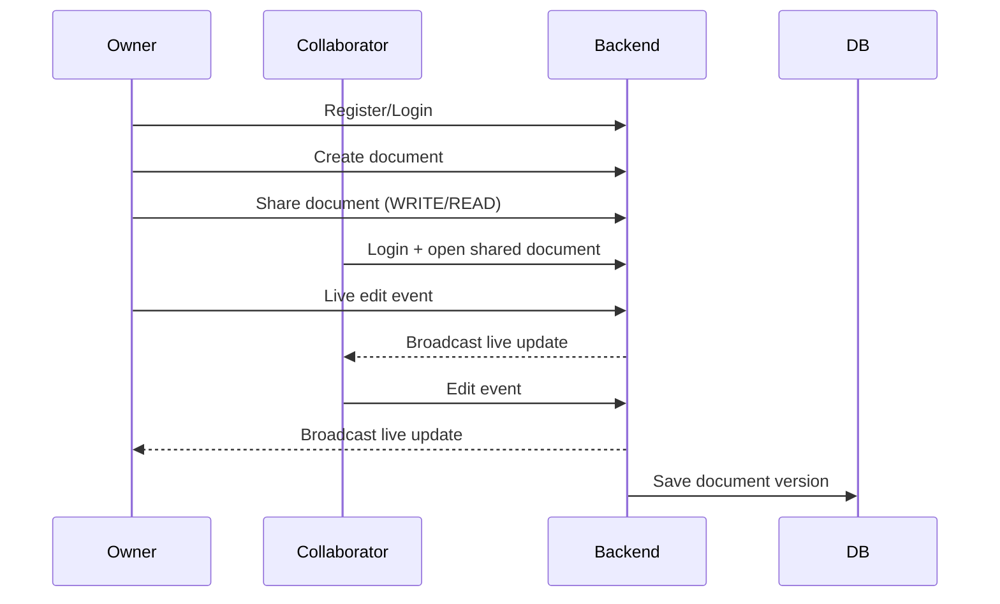
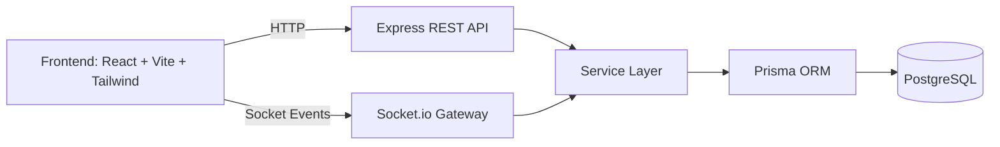

<p align="center">
  
</p>

<p align="center">
  
  
  
  
  
</p>

<p align="center">
  <a href="#for-everyone-simple-explanation">Simple Explanation</a> |
  <a href="#feature-cards">Features</a> |
  <a href="#quick-start-docker">Quick Start</a> |
  <a href="#api--realtime">API</a> |
  <a href="#license">License</a>
</p>

---

## For Everyone (Simple Explanation)

If you are non-technical, this project means:

> A private company-style Google Docs where multiple users can open the same file, edit together live, and safely restore old versions.

Main benefits:
- users can sign up and log in securely
- documents can be shared with specific people
- access can be controlled (`READ` or `WRITE`)
- typing changes are visible in real time
- old versions can be restored if something goes wrong

## Feature Cards

<table>
  <tr>
    <td width="33%">
      <h3>Secure Auth</h3>
      <p>JWT login flow with password hashing and protected APIs.</p>
    </td>
    <td width="33%">
      <h3>Live Collaboration</h3>
      <p>Socket-based real-time sync for document updates.</p>
    </td>
    <td width="33%">
      <h3>Access Control</h3>
      <p>Owner, collaborator, and permission-based sharing model.</p>
    </td>
  </tr>
  <tr>
    <td width="33%">
      <h3>Version History</h3>
      <p>Track historical versions and restore older content.</p>
    </td>
    <td width="33%">
      <h3>Team Presence</h3>
      <p>Collaborator join notifications and cursor updates.</p>
    </td>
    <td width="33%">
      <h3>Deployment Ready</h3>
      <p>Dockerized backend, frontend, and PostgreSQL setup.</p>
    </td>
  </tr>
</table>

## Product Flow



## Architecture



## Tech Stack

- Frontend: React, TypeScript, Vite, Tailwind CSS, Zustand, Socket.io-client
- Backend: Node.js, Express, Socket.io, Prisma, Zod, JWT
- Database: PostgreSQL
- Testing: Jest, Supertest, socket.io-client
- Runtime/Infra: Docker, Docker Compose, Nginx

## Repository Structure

```text
.
|-- backend/
|   |-- prisma/
|   |-- src/
|   |-- tests/
|   `-- package.json
|-- frontend/
|   |-- src/
|   `-- package.json
|-- docker-compose.yml
|-- LICENSE
`-- README.md
```

## Quick Start (Docker)

```bash
docker compose up --build
```

Available services:
- Frontend: `http://localhost:8080`
- Backend: `http://localhost:4000`
- DB: `localhost:5432`
- Health: `http://localhost:4000/health`

## Local Development

### Install dependencies

```bash
cd backend && npm install
cd ../frontend && npm install
```

### Configure environment files

```bash
cp backend/.env.example backend/.env
cp frontend/.env.example frontend/.env
```

PowerShell alternative:

```powershell
Copy-Item backend/.env.example backend/.env
Copy-Item frontend/.env.example frontend/.env
```

### Prepare database

```bash
cd backend
npx prisma generate
npx prisma migrate dev --name init
```

### Run development servers

```bash
# terminal 1
cd backend
npm run dev

# terminal 2
cd frontend
npm run dev
```

## API + Realtime

### Auth APIs
- `POST /api/auth/register`
- `POST /api/auth/login`
- `POST /api/auth/logout`
- `GET /api/auth/me`

### Document APIs
- `GET /api/documents`
- `POST /api/documents`
- `GET /api/documents/:id`
- `PUT /api/documents/:id`
- `DELETE /api/documents/:id`
- `POST /api/documents/:id/share`
- `GET /api/documents/:id/versions`
- `POST /api/documents/:id/versions/:versionId/restore`

### Socket Events

| Event | Direction | Purpose |
|---|---|---|
| `document:join` | Client -> Server | Join document room |
| `document:update` | Client -> Server | Sync content changes |
| `cursor:update` | Client -> Server | Sync cursor metadata |
| `notification:collaborator-joined` | Server -> Clients | Notify collaborator join |

## Security and Quality

- Bcrypt hashing (`12` rounds)
- JWT route protection
- Zod request validation
- Rate limiting
- Helmet security headers
- Prisma ORM protection layer
- Unit/integration/socket tests

Run backend tests:

```bash
cd backend
npm test
```

Build frontend:

```bash
cd frontend
npm run build
```

## Deployment Targets

- Render
- Railway
- AWS (ECS + RDS + ALB)

Use production secrets and run:

```bash
npx prisma migrate deploy
```

## License

This project is **Proprietary (All Rights Reserved)**.

You are not allowed to copy, modify, distribute, sell, or commercially use this code without written permission from the author.

Full legal terms: [LICENSE](./LICENSE)
