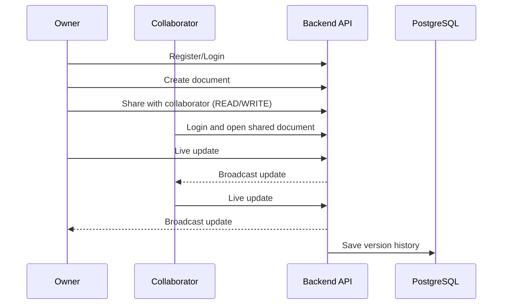
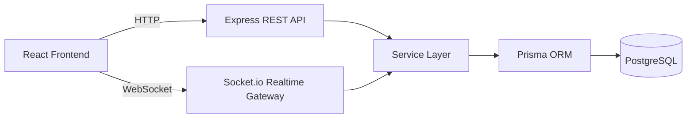

<p align="center">
  
</p>

<p align="center">
  
  
  
  
  
  
</p>

<p align="center">
  <a href="#what-this-project-does-non-tech">What It Is</a> |
  <a href="#feature-showcase">Feature Showcase</a> |
  <a href="#quick-start-docker">Quick Start</a> |
  <a href="#api--realtime-contract">API</a> |
  <a href="#license">License</a>
</p>

---

## What This Project Does (Non-Tech)

Think of this as a private company version of Google Docs.

You create documents, share them with selected people, and everyone can work on the same file at the same time.
Changes appear instantly, and older versions can be restored if needed.

### Why this is useful

- no confusion of "latest file version"
- teams edit in one place together
- access is controlled per user (`READ` / `WRITE`)
- secure login + controlled sharing

## Product Snapshot

<table>
  <tr>
    <td width="50%">
      <h3>Who is it for?</h3>
      <p>Teams, agencies, startups, and internal company workflows where people need live document collaboration.</p>
    </td>
    <td width="50%">
      <h3>What problem does it solve?</h3>
      <p>Eliminates file version chaos and enables real-time, permission-controlled editing in one source of truth.</p>
    </td>
  </tr>
  <tr>
    <td width="50%">
      <h3>How does it feel?</h3>
      <p>Google Docs-like interaction: live updates, collaborator activity, and version safety.</p>
    </td>
    <td width="50%">
      <h3>Deployment style</h3>
      <p>Dockerized full-stack setup for local, staging, and production usage.</p>
    </td>
  </tr>
</table>

## Feature Showcase

<table>
  <tr>
    <td width="33%">
      <h3>Secure Authentication</h3>
      <p>JWT auth with bcrypt-hashed passwords and protected routes.</p>
    </td>
    <td width="33%">
      <h3>Document CRUD</h3>
      <p>Create, edit, list, and delete documents with ownership logic.</p>
    </td>
    <td width="33%">
      <h3>Access Permissions</h3>
      <p>Share document access as <code>READ</code> or <code>WRITE</code>.</p>
    </td>
  </tr>
  <tr>
    <td width="33%">
      <h3>Live Collaboration</h3>
      <p>Real-time sync for content updates through Socket.io events.</p>
    </td>
    <td width="33%">
      <h3>Presence Signals</h3>
      <p>Collaborator join notifications and cursor activity updates.</p>
    </td>
    <td width="33%">
      <h3>Version Restore</h3>
      <p>Version history storage with ability to restore older content.</p>
    </td>
  </tr>
</table>

## User Journey



## System Architecture



## Tech Stack

- Frontend: React, TypeScript, Vite, Tailwind CSS, Zustand, Socket.io-client
- Backend: Node.js, Express, Socket.io, Prisma, Zod, JWT
- Database: PostgreSQL
- Testing: Jest, Supertest, socket.io-client
- Infra: Docker, Docker Compose, Nginx

## Repository Layout

```text
.
|-- backend/
|   |-- prisma/
|   |-- src/
|   |-- tests/
|   `-- package.json
|-- frontend/
|   |-- src/
|   `-- package.json
|-- docker-compose.yml
|-- LICENSE
`-- README.md
```

## Quick Start (Docker)

```bash
docker compose up --build
```

Service URLs:
- Frontend: `http://localhost:8080`
- Backend: `http://localhost:4000`
- PostgreSQL: `localhost:5432`
- Health: `http://localhost:4000/health`

## Local Development

### 1) Install dependencies

```bash
cd backend && npm install
cd ../frontend && npm install
```

### 2) Configure env files

```bash
cp backend/.env.example backend/.env
cp frontend/.env.example frontend/.env
```

PowerShell:

```powershell
Copy-Item backend/.env.example backend/.env
Copy-Item frontend/.env.example frontend/.env
```

### 3) Initialize database

```bash
cd backend
npx prisma generate
npx prisma migrate dev --name init
```

### 4) Run apps

```bash
# terminal 1
cd backend
npm run dev

# terminal 2
cd frontend
npm run dev
```

## API + Realtime Contract

### Auth Endpoints
- `POST /api/auth/register`
- `POST /api/auth/login`
- `POST /api/auth/logout`
- `GET /api/auth/me`

### Document Endpoints
- `GET /api/documents`
- `POST /api/documents`
- `GET /api/documents/:id`
- `PUT /api/documents/:id`
- `DELETE /api/documents/:id`
- `POST /api/documents/:id/share`
- `GET /api/documents/:id/versions`
- `POST /api/documents/:id/versions/:versionId/restore`

### Socket Events

| Event | Direction | Purpose |
|---|---|---|
| `document:join` | Client -> Server | Join document room |
| `document:update` | Client -> Server | Send content updates |
| `cursor:update` | Client -> Server | Send cursor metadata |
| `notification:collaborator-joined` | Server -> Clients | Notify when user joins |

## Security and Reliability

- bcrypt hashing (`12` rounds)
- JWT-protected routes
- Zod request validation
- Rate limiting (global + auth)
- Helmet security headers
- Prisma ORM safety layer
- API and socket tests

Run tests:

```bash
cd backend
npm test
```

Build frontend:

```bash
cd frontend
npm run build
```

## Deployment Targets

- Render
- Railway
- AWS (ECS + RDS + ALB)

Use production secrets and deploy migrations with:

```bash
npx prisma migrate deploy
```

## License

This repository is licensed as **Proprietary (All Rights Reserved)**.

Without written permission, you are not allowed to copy, modify, distribute, sublicense, sell, or commercially use this codebase.

Full terms: [LICENSE](./LICENSE)
