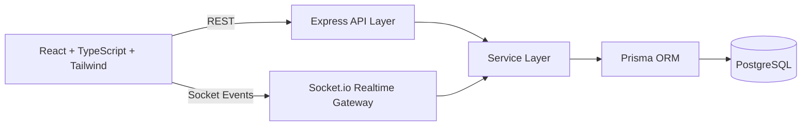

# Real-Time Collaboration Platform

A production-grade full-stack collaboration platform inspired by Google Docs for multi-user live editing, version history, sharing, and access control.

## Project Overview

This system enables:
- Secure user registration/login with JWT auth
- Document CRUD with owner/collaborator permissions
- Real-time collaboration via Socket.io
- Cursor sharing and collaborator join notifications
- Version history and restore workflows
- Dockerized local and production-friendly setup

## Architecture Diagram



## Tech Stack

- Frontend: React, TypeScript, Tailwind CSS, Vite, Socket.io-client, Zustand
- Backend: Node.js, Express, Socket.io, JWT, Zod validation, Prisma
- Database: PostgreSQL
- Testing: Jest, Supertest, Socket.io-client (event test)
- Quality: ESLint, Prettier
- DevOps: Docker, Docker Compose, Nginx (frontend runtime)

## Folder Structure

```text
.
├── backend
│   ├── prisma
│   │   └── schema.prisma
│   ├── src
│   │   ├── config
│   │   │   └── env.ts
│   │   ├── controllers
│   │   │   ├── auth.controller.ts
│   │   │   └── document.controller.ts
│   │   ├── lib
│   │   │   └── prisma.ts
│   │   ├── middlewares
│   │   │   ├── auth.middleware.ts
│   │   │   ├── error.middleware.ts
│   │   │   ├── rateLimiter.middleware.ts
│   │   │   └── validation.middleware.ts
│   │   ├── models
│   │   │   ├── auth.model.ts
│   │   │   └── document.model.ts
│   │   ├── routes
│   │   │   ├── auth.routes.ts
│   │   │   ├── document.routes.ts
│   │   │   └── index.ts
│   │   ├── services
│   │   │   ├── auth.service.ts
│   │   │   └── document.service.ts
│   │   ├── sockets
│   │   │   └── collaboration.socket.ts
│   │   ├── types
│   │   │   └── express.d.ts
│   │   ├── utils
│   │   │   ├── asyncHandler.ts
│   │   │   ├── httpError.ts
│   │   │   ├── jwt.ts
│   │   │   └── password.ts
│   │   ├── app.ts
│   │   └── server.ts
│   ├── tests
│   │   ├── auth.routes.test.ts
│   │   ├── document.routes.test.ts
│   │   └── socket.events.test.ts
│   ├── Dockerfile
│   └── package.json
├── frontend
│   ├── src
│   │   ├── components
│   │   │   ├── editor
│   │   │   │   └── CollaborativeEditor.tsx
│   │   │   └── layout
│   │   │       └── AppShell.tsx
│   │   ├── hooks
│   │   │   ├── useAuth.ts
│   │   │   └── useSocket.ts
│   │   ├── pages
│   │   │   ├── DashboardPage.tsx
│   │   │   ├── DocumentEditorPage.tsx
│   │   │   ├── LoginPage.tsx
│   │   │   └── RegisterPage.tsx
│   │   ├── services
│   │   │   ├── api.ts
│   │   │   ├── auth.service.ts
│   │   │   └── document.service.ts
│   │   ├── store
│   │   │   └── authStore.ts
│   │   ├── types
│   │   │   └── index.ts
│   │   ├── App.tsx
│   │   ├── index.css
│   │   └── main.tsx
│   ├── Dockerfile
│   └── package.json
├── docker-compose.yml
└── README.md
```

## Installation (Local)

### 1. Clone and install dependencies

```bash
cd backend && npm install
cd ../frontend && npm install
```

### 2. Configure environment variables

```bash
cp backend/.env.example backend/.env
cp frontend/.env.example frontend/.env
```

### 3. Initialize database

```bash
cd backend
npx prisma generate
npx prisma migrate dev --name init
```

### 4. Run backend + frontend

```bash
# Terminal 1
cd backend
npm run dev

# Terminal 2
cd frontend
npm run dev
```

Frontend: `http://localhost:5173`  
Backend: `http://localhost:4000`

## Environment Variables

### Backend (`backend/.env`)

- `NODE_ENV`
- `PORT`
- `DATABASE_URL`
- `JWT_SECRET`
- `JWT_EXPIRES_IN`
- `CORS_ORIGIN`

### Frontend (`frontend/.env`)

- `VITE_API_BASE_URL`
- `VITE_SOCKET_URL`

## Docker Setup

```bash
docker compose up --build
```

Services:
- Frontend: `http://localhost:8080`
- Backend: `http://localhost:4000`
- PostgreSQL: `localhost:5432`

Note: backend container runs `prisma db push` on startup to sync schema.

## API Documentation

### Auth

- `POST /api/auth/register`
- `POST /api/auth/login`
- `POST /api/auth/logout`
- `GET /api/auth/me`

### Documents

- `GET /api/documents`
- `POST /api/documents`
- `GET /api/documents/:id`
- `PUT /api/documents/:id`
- `DELETE /api/documents/:id`
- `POST /api/documents/:id/share`
- `GET /api/documents/:id/versions`
- `POST /api/documents/:id/versions/:versionId/restore`

## Realtime Events

- `document:join` -> joins document room, emits `notification:collaborator-joined`
- `document:update` -> syncs content updates to collaborators
- `cursor:update` -> broadcasts cursor position metadata

## Security Highlights

- Password hashing with bcrypt (`12` rounds)
- JWT verification middleware
- Input validation with Zod
- Global and auth-specific rate limits
- Helmet security headers
- Prisma ORM to prevent SQL injection risks
- Secrets moved to environment variables

## Testing

Backend tests include examples for:
- Auth route testing (`Supertest`)
- Document creation endpoint (`Supertest`)
- Socket event broadcast behavior (`socket.io-client`)

Run tests:

```bash
cd backend
npm test
```

## Screenshots (Placeholders)

- `docs/screenshots/dashboard.png`
- `docs/screenshots/editor.png`
- `docs/screenshots/version-history.png`

## Deployment Guide

### Render

1. Create PostgreSQL service.
2. Deploy backend as a Web Service from `backend/`.
3. Set backend env vars (`DATABASE_URL`, `JWT_SECRET`, `CORS_ORIGIN`, etc.).
4. Deploy frontend as a Static Site from `frontend/` with:
   - Build command: `npm install && npm run build`
   - Publish directory: `dist`
5. Point frontend env vars to Render backend URL.

### Railway

1. Provision PostgreSQL plugin.
2. Create backend service (root `backend/`).
3. Set environment variables and run migrations (`prisma migrate deploy`).
4. Create frontend service (root `frontend/`) and expose built app.
5. Set `VITE_API_BASE_URL` and `VITE_SOCKET_URL` to Railway backend URL.

### AWS (ECS + RDS + ALB)

1. Push backend/frontend container images to ECR.
2. Create RDS PostgreSQL instance.
3. Deploy backend on ECS Fargate with environment secrets from AWS Secrets Manager.
4. Deploy frontend container behind ALB (or publish static build via S3 + CloudFront).
5. Enable HTTPS/TLS and configure CORS for production domain.

## Future Improvements

- CRDT/Operational Transform for advanced conflict-free editing
- Redis adapter for horizontal Socket.io scaling
- Refresh token + token revocation list
- Rich text editor (Slate/Lexical/TipTap)
- Fine-grained audit logs and document activity feed
- E2E tests (Playwright/Cypress)
